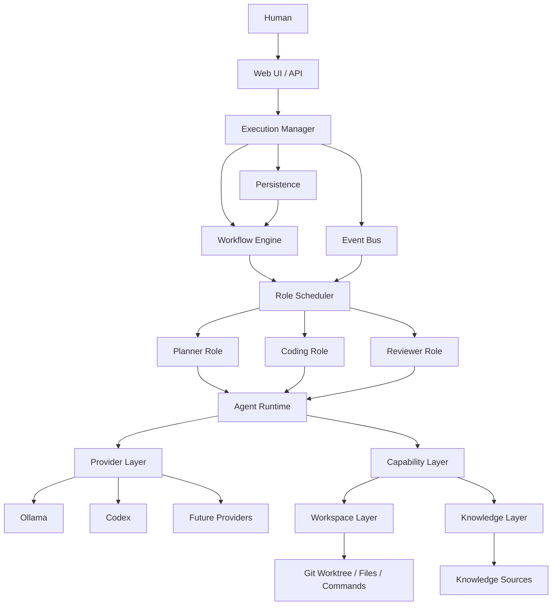
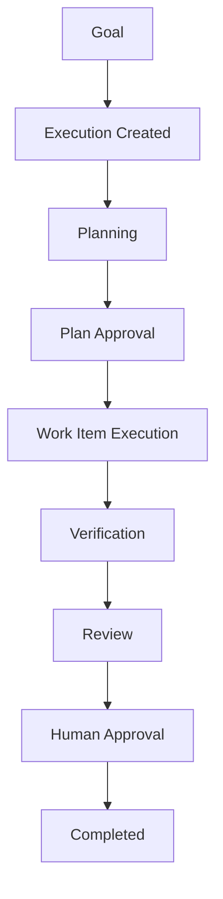
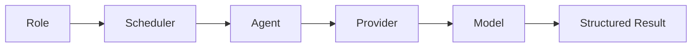
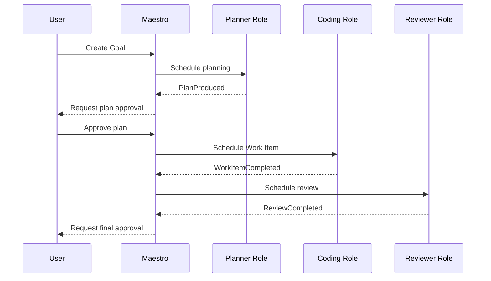

# System Architecture

Version: 0.1

## Overview

Maestro is a local-first AI execution orchestration system designed to coordinate specialized Roles in order to accomplish complex engineering work.

Maestro is not conversation-centric.

It is Execution-centric.

The primary object in the system is an **Execution**.

Everything else exists to support the lifecycle of an Execution.

## Architecture Goals

The architecture must remain:

- provider agnostic;
- local first;
- event driven;
- persistent;
- secure;
- observable;
- extensible;
- deterministic at the workflow level.

## High-Level Architecture



## Core Architectural Layers

### Presentation Layer

Responsible for user interaction.

Examples:

- Web UI;
- CLI;
- REST API;
- future mobile clients.

Responsibilities:

- receive goals and approvals;
- display Execution progress;
- display plans, logs, diffs, reviews, and artifacts.

This layer contains no domain workflow logic.

### Execution Layer

The heart of Maestro.

Responsible for:

- creating Executions;
- resuming Executions;
- cancelling Executions;
- archiving Executions;
- exposing current Execution state.

No model owns Execution state.

### Workflow Layer

Defines how an Execution progresses through its lifecycle.

Example:

```text
Planning
  ↓
Plan Approval
  ↓
Coding
  ↓
Testing
  ↓
Review
  ↓
Final Approval
  ↓
Completed
```

Workflows contain no provider-specific logic.

### Event Layer

Every meaningful state change emits a persisted event.

Examples:

- `ExecutionCreated`;
- `PlanningStarted`;
- `PlanProduced`;
- `PlanApproved`;
- `CodingStarted`;
- `CodingCompleted`;
- `VerificationCompleted`;
- `ReviewCompleted`;
- `ExecutionCompleted`.

Events provide loose coupling, auditability, and replayability.

### Scheduling Layer

Responsible for deciding which Role should execute next.

The scheduler owns:

- ordering;
- retries;
- concurrency;
- priorities;
- resource assignment;
- Agent selection.

Roles never schedule one another.

### Role Layer

Roles define responsibilities.

Examples:

- Planner;
- Backend Developer;
- Frontend Developer;
- Reviewer;
- Researcher;
- Documentation Writer.

A Role defines:

- purpose;
- required input contract;
- output schema;
- permitted Capabilities;
- policy constraints.

A Role does not define a specific model.

### Agent Layer

An Agent is a runtime instance fulfilling a Role.

An Agent combines:

```text
Role
+
Provider
+
Model
+
Capabilities
+
Execution Context
```

The same Role may be fulfilled by different Agents over time.

### Provider Layer

Provides access to models and external AI services.

Initial providers:

- Ollama for local Planner and Coding models;
- Codex CLI or SDK for the Reviewer.

Future providers may include:

- OpenAI;
- Anthropic;
- Google;
- vLLM;
- LM Studio;
- other local or remote runtimes.

Provider-specific behavior must remain behind a common interface.

### Capability Layer

Capabilities describe what an Agent is permitted to do.

Examples:

- `filesystem.read`;
- `filesystem.write`;
- `filesystem.edit`;
- `shell.execute`;
- `git.status`;
- `git.diff`;
- `knowledge.search`;
- `web.search`.

Roles are granted Capabilities.

Tools implement Capabilities.

The model does not grant itself permissions.

### Workspace Layer

Provides an isolated execution environment.

Responsibilities:

- create a Workspace;
- prepare a Git branch or worktree;
- enforce filesystem boundaries;
- execute approved commands;
- collect diffs, logs, and other artifacts;
- clean up safely.

For software projects, each Execution should receive its own Git worktree.

### Knowledge Layer

Provides contextual information through Knowledge Sources.

Potential sources include:

- local Markdown;
- NAS directories;
- Git repositories;
- Odysseus Documents;
- Obsidian;
- Confluence;
- PDF collections;
- future external systems.

Knowledge remains external to models and Agents.

### Persistence Layer

Provides durable storage for:

- Projects;
- Executions;
- Plans;
- Work Items;
- Agent invocations;
- Artifacts;
- Reviews;
- Events;
- workflow checkpoints;
- approval decisions.

Nothing important should exist only in process memory.

## Execution Lifecycle

Everything in Maestro revolves around an Execution.



An Execution is a durable engineering record.

## Role Execution

A Role does not execute itself.



Roles describe intent.

Agents perform execution.

Providers connect Agents to models.

## Event Flow

Components communicate through persisted events rather than direct Role-to-Role calls.



## Separation of Responsibilities

| Layer | Responsibility |
|---|---|
| Presentation | User interaction |
| Execution | Execution lifecycle |
| Workflow | State transitions |
| Events | Decoupled communication and audit trail |
| Scheduler | Role and Agent assignment |
| Roles | Responsibilities and contracts |
| Agents | Runtime Role execution |
| Providers | Model access |
| Capabilities | Permission boundaries |
| Workspace | Safe file and command execution |
| Knowledge | Context retrieval |
| Persistence | Durable state |

## Why Roles Instead of Agents

A Role defines what must be accomplished.

An Agent defines how the Role is executed at runtime.

Example:

```text
Backend Developer Role
  ↓
Agent #17
  ↓
Ollama Provider
  ↓
Qwen Coding Model
```

Later:

```text
Backend Developer Role
  ↓
Agent #31
  ↓
OpenAI Provider
  ↓
Future Coding Model
```

The workflow does not change.

## Why Events Instead of Direct Calls

Direct Role-to-Role invocation creates coupling and hidden control flow.

Maestro instead persists outcomes as events and lets the scheduler determine the next step.

This makes executions observable, resumable, replayable, and easier to test.

## Why Executions Instead of Conversations

Conversations are an interface detail.

Executions represent real work.

An Execution includes:

- a Goal;
- a Plan;
- Work Items;
- state transitions;
- Agent invocations;
- Artifacts;
- Reviews;
- approvals;
- final status.

Executions become permanent engineering records.

## Architectural Boundaries

Subsystems communicate only through interfaces and domain contracts.

Dependencies should point inward toward the domain.

```text
Presentation
  ↓
Application / Execution Services
  ↓
Domain
  ↓
Interfaces
  ↓
Infrastructure Adapters
```

Infrastructure adapters must not define domain behavior.

## Initial MVP Deployment

The first version may run as a single process on one machine.

```text
FastAPI Application
  ├── Web UI
  ├── Execution Manager
  ├── Workflow Engine
  ├── SQLite
  ├── Ollama Adapter
  ├── Codex Adapter
  └── Local Workspace Manager
```

The architecture should permit later separation into remote workers without requiring a domain redesign.

## Summary

Everything in Maestro exists to support the lifecycle of an Execution.

Roles define responsibilities.

Agents fulfill Roles.

Providers connect Agents to models.

Capabilities enforce permissions.

Workspaces isolate execution.

Events coordinate the system.

Persistence preserves the complete engineering process.

This separation allows Maestro to remain provider-agnostic, local-first, secure, observable, and extensible.
