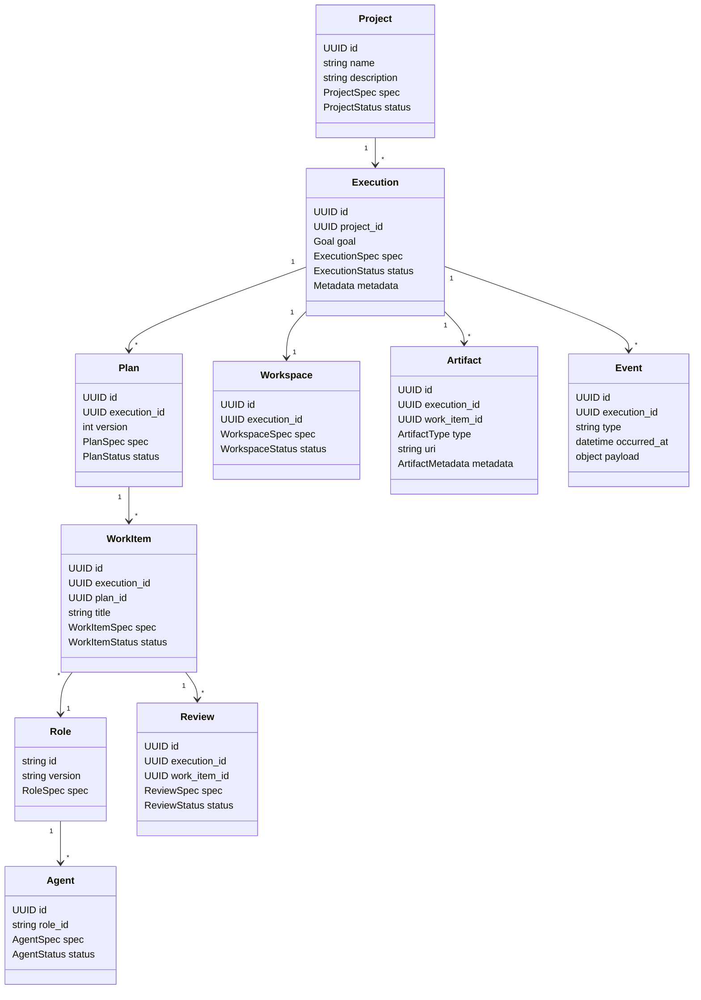

# Domain Model

Version: 0.1

## Purpose

This document defines Maestro's canonical domain model.

The domain model describes the concepts Maestro manages independently of any specific web framework, database, model provider, queue, or deployment topology.

The design follows a Kubernetes-like philosophy:

- users declare desired outcomes;
- Maestro persists desired and observed state;
- controllers reconcile the difference;
- Roles describe responsibility;
- Agents are replaceable runtime instances;
- Workspaces isolate execution;
- Events provide an immutable audit trail;
- status is derived from observed execution, not model claims.

The domain model is intentionally execution-centric rather than conversation-centric.

## Core Model



## Resource Shape

Every first-class resource should use a common resource envelope.

```yaml
apiVersion: maestro.dev/v1alpha1
kind: Execution
metadata:
  id: 9ecf...
  name: add-health-endpoint
  projectId: 7b31...
  createdAt: 2026-07-11T12:00:00Z
  createdBy: user
  labels:
    domain: backend
spec:
  goal: ...
  workflowRef: software-delivery/v1
status:
  phase: WaitingForPlanApproval
  observedGeneration: 1
  conditions: []
```

The common shape is:

```text
apiVersion
kind
metadata
spec
status
```

### `metadata`

Identity, ownership, labels, timestamps, version, and provenance.

### `spec`

The desired state declared by a human, workflow, or controller.

### `status`

The observed state reported by Maestro controllers.

Models may propose values for `spec`, but they do not write `status` directly.

## Design Rule: Spec and Status Are Separate

This is one of Maestro's most important invariants.

`spec` describes what should happen.

`status` describes what has actually happened.

Example:

```yaml
spec:
  verificationCommands:
    - pytest

status:
  verification:
    commands:
      - command: pytest
        exitCode: 1
        result: failed
```

A Coding Role may claim that tests passed in its natural-language result.

Maestro only marks verification successful after independently observing the process exit code.

## Resource Metadata

```yaml
metadata:
  id: UUID
  name: string
  generation: integer
  resourceVersion: integer
  createdAt: datetime
  updatedAt: datetime
  createdBy: string
  labels: map[string]string
  annotations: map[string]string
```

### `generation`

Incremented when `spec` changes.

### `resourceVersion`

Incremented on every persisted update, including status changes.

### Labels

Labels support selection and scheduling.

Examples:

```yaml
labels:
  project: tour-manager
  area: backend
  priority: high
  environment: local
```

### Annotations

Annotations contain non-identifying auxiliary information.

Examples:

```yaml
annotations:
  maestro.dev/request-source: web-ui
  maestro.dev/original-prompt-sha256: ...
```

## Project

A Project groups Executions, repositories, policies, knowledge bindings, and defaults.

A Project is not necessarily a single repository.

### Project Spec

```yaml
apiVersion: maestro.dev/v1alpha1
kind: Project
metadata:
  name: tour-manager
spec:
  description: Touring musicians management application
  repositories:
    - id: backend
      path: /repos/tour-manager-backend
      defaultBranch: main
    - id: frontend
      path: /repos/tour-manager-frontend
      defaultBranch: main
  roleBindings:
    planner: planner-local
    coder: coder-local
    reviewer: codex-reviewer
  knowledgeBindings:
    - project-docs
  policies:
    allowNetwork: false
    requirePlanApproval: true
    requireFinalApproval: true
```

### Project Status

```yaml
status:
  phase: Ready
  repositories:
    - id: backend
      reachable: true
      clean: true
  conditions:
    - type: Ready
      status: "True"
      reason: RepositoriesValidated
```

### Project Invariants

- Project names must be unique within an installation.
- Repository identities must be unique within a Project.
- A Project may exist without any Executions.
- Deleting a Project must never silently delete repository data.
- Historical Executions must remain auditable after Project archival.

## Goal

A Goal is the human-owned statement of intended outcome.

A Goal belongs to exactly one Execution.

```yaml
goal:
  summary: Add a health endpoint
  description: |
    Create GET /health and return {"status":"ok"}.
  constraints:
    - Do not add a database
    - Do not modify authentication
  acceptanceCriteria:
    - GET /health returns HTTP 200
    - Automated tests pass
```

### Goal Invariants

- An Execution must have exactly one Goal.
- A Goal is immutable after the Execution leaves `Draft`, unless a human creates a new revision.
- Models may clarify or decompose a Goal, but cannot silently redefine it.
- Goal revisions must be persisted and attributable.

## Execution

An Execution is one complete orchestration run from Goal to terminal outcome.

It is the central aggregate root.

### Execution Spec

```yaml
spec:
  goal:
    summary: Add a health endpoint
  workflowRef:
    name: software-delivery
    version: v1
  projectRef: tour-manager
  policyRef: default-safe
  requestedRoles:
    - planner
    - coder
    - reviewer
  limits:
    maxCodingIterations: 2
    maxReviewIterations: 2
    maxDurationSeconds: 3600
```

### Execution Status

```yaml
status:
  phase: Reviewing
  currentStep: review
  observedGeneration: 1
  activeWorkItems:
    - workitem-3
  conditions:
    - type: PlanApproved
      status: "True"
    - type: VerificationPassed
      status: "True"
  startedAt: ...
  updatedAt: ...
```

### Execution Phases

Recommended initial phases:

```text
Draft
Planning
WaitingForUserInput
WaitingForPlanApproval
PreparingWorkspace
Executing
Verifying
Reviewing
WaitingForFinalApproval
Completed
Failed
Cancelled
Archived
```

### Terminal Phases

```text
Completed
Failed
Cancelled
Archived
```

### Execution Invariants

- An Execution belongs to exactly one Project.
- An Execution has exactly one active Workflow definition.
- Only Maestro controllers mutate Execution status.
- An Execution may have multiple Plan revisions but only one approved Plan revision at a time.
- Terminal Executions cannot resume without an explicit retry or fork operation.
- Every status transition must produce an Event.
- Every role invocation must be attributable to an Execution.

## Plan

A Plan is a versioned proposal produced by the Planner Role.

A Plan is not itself a workflow.

It describes how to satisfy the Goal using ordered or dependent Work Items.

### Plan Spec

```yaml
spec:
  summary: Bootstrap the API and add a health endpoint
  assumptions:
    - Python 3.12 is available
    - FastAPI is acceptable
  questions: []
  risks:
    - The repository is currently empty
  workItems:
    - id: bootstrap-backend
      title: Bootstrap backend project
      roleRef: backend-developer
      repositoryRef: backend
      dependsOn: []
      acceptanceCriteria:
        - Application starts
        - pytest passes
```

### Plan Status

```yaml
status:
  phase: Approved
  approvedBy: user
  approvedAt: ...
  validation:
    valid: true
    errors: []
```

### Plan Phases

```text
Draft
Validating
WaitingForInput
WaitingForApproval
Approved
Rejected
Superseded
```

### Plan Invariants

- A Plan belongs to exactly one Execution.
- Plan versions are immutable after creation.
- Plan approval is human-owned in the MVP.
- Every Work Item must reference a Role.
- Every Work Item must include acceptance criteria.
- Dependency graphs must be acyclic.
- A rejected Plan is never mutated; a new Plan revision is created.

## Work Item

A Work Item is the smallest schedulable unit of work.

It is broader than a programming task.

Examples:

- implement an API endpoint;
- research a dependency;
- write documentation;
- review a diff;
- create a migration proposal;
- benchmark a model.

### Work Item Spec

```yaml
spec:
  roleRef: backend-developer
  repositoryRef: backend
  objective: Create GET /health
  context:
    - artifact://plan/approved
    - knowledge://project/architecture
  constraints:
    - Do not add dependencies without approval
  acceptanceCriteria:
    - GET /health returns 200
    - Response equals {"status":"ok"}
    - Tests pass
  verification:
    commands:
      - pytest
  dependsOn:
    - bootstrap-backend
  capabilities:
    - filesystem.read
    - filesystem.write
    - shell.execute.test
    - git.diff
```

### Work Item Status

```yaml
status:
  phase: Running
  assignedAgentId: ...
  attempts: 1
  startedAt: ...
  completedAt: null
  resultRef: null
  conditions: []
```

### Work Item Phases

```text
Pending
Ready
Scheduled
Running
WaitingForApproval
Verifying
Reviewing
Succeeded
Failed
Cancelled
Blocked
```

### Work Item Invariants

- A Work Item belongs to exactly one Execution and one Plan revision.
- A Work Item references exactly one owning Role.
- A Work Item may have zero or more dependencies.
- A Work Item is `Ready` only when all dependencies have succeeded.
- An Agent may execute a Work Item, but cannot change its workflow state directly.
- Success requires Maestro verification, not only an Agent report.
- A failed Work Item may be retried under explicit retry policy.

## Role

A Role defines responsibility and policy.

A Role is declarative and model-independent.

```yaml
apiVersion: maestro.dev/v1alpha1
kind: Role
metadata:
  name: backend-developer
spec:
  purpose: Implement backend Work Items
  inputSchemaRef: BackendWorkItemInput/v1
  outputSchemaRef: CodingResult/v1
  requiredCapabilities:
    - filesystem.read
    - filesystem.write
    - git.diff
  optionalCapabilities:
    - shell.execute.test
    - knowledge.search
  prohibitedCapabilities:
    - git.push
    - deployment.execute
  policies:
    maxSteps: 40
    requireVerification: true
```

### Role Invariants

- Roles are versioned.
- A Role does not reference a specific model.
- Role permissions are expressed through Capabilities.
- Role output must validate against a schema.
- Workflows reference Roles, not Agents or models.

## Agent

An Agent is a runtime configuration capable of fulfilling one or more compatible Roles.

```yaml
apiVersion: maestro.dev/v1alpha1
kind: Agent
metadata:
  name: coder-local
spec:
  providerRef: ollama-local
  model: qwen2.5-coder:14b
  supportedRoles:
    - backend-developer
    - frontend-developer
  capacity:
    maxConcurrentAssignments: 1
  capabilityBindings:
    - local-workspace-safe
status:
  phase: Ready
  currentAssignments: 0
```

### Agent Invariants

- An Agent is replaceable.
- Agent state is operational, not project knowledge.
- Agent selection is performed by the scheduler.
- An Agent cannot grant itself additional Capabilities.
- Agent output must be treated as untrusted until validated.

## Provider

A Provider is an adapter to a model runtime or external AI service.

```yaml
apiVersion: maestro.dev/v1alpha1
kind: Provider
metadata:
  name: ollama-local
spec:
  type: ollama
  endpoint: http://127.0.0.1:11434
  authenticationRef: null
  capabilities:
    structuredOutput: true
    toolCalling: true
status:
  phase: Ready
```

Provider concerns remain infrastructure-level and are not part of workflow semantics.

## Capability

A Capability is a permission to perform a category of operation.

Examples:

```text
filesystem.read
filesystem.write
filesystem.edit
shell.execute.test
shell.execute.build
git.status
git.diff
knowledge.search
web.search
```

Capabilities are separate from tools.

A tool is an implementation.

A Capability is an authorization contract.

Example:

```text
Capability: filesystem.read
Implemented by:
- LocalFilesystemTool
- RemoteSSHFilesystemTool
- ContainerFilesystemTool
```

## Workspace

A Workspace is an isolated environment used for Work Item execution.

```yaml
spec:
  type: git-worktree
  repositoryRef: backend
  baseRevision: main
  branchName: maestro/execution-123
  path: /var/lib/maestro/workspaces/execution-123/backend
  networkPolicy: deny
status:
  phase: Ready
  observedRevision: abc123
  dirty: false
```

### Workspace Invariants

- Every filesystem path exposed to an Agent must resolve inside the Workspace boundary.
- Workspaces must not expose secrets by default.
- Workspaces must be attributable to an Execution.
- An Execution may own multiple Workspaces when multiple repositories are involved.
- Workspace cleanup must never delete the source repository.

## Artifact

An Artifact is a durable output produced during an Execution.

Artifact types include:

```text
plan
prompt
model-response
tool-log
command-output
git-diff
test-report
review
patch
summary
knowledge-result
```

```yaml
apiVersion: maestro.dev/v1alpha1
kind: Artifact
metadata:
  name: backend-diff
spec:
  executionRef: execution-123
  workItemRef: implement-health
  type: git-diff
  mediaType: text/x-diff
  uri: file:///...
  sha256: ...
```

### Artifact Invariants

- Artifacts are immutable after creation.
- Artifact content must be checksummed.
- Artifact provenance must identify the producing Role invocation or Maestro subsystem.
- Large artifacts may be stored externally, but metadata remains persisted.

## Review

A Review is a structured evaluation of one or more Artifacts against explicit criteria.

```yaml
spec:
  subjectRefs:
    - artifact://backend-diff
    - artifact://test-report
  acceptanceCriteria:
    - GET /health returns 200
  reviewerRoleRef: reviewer
status:
  verdict: RequestChanges
  blockingFindings:
    - severity: high
      file: app/main.py
      issue: Response does not match the contract
  nonBlockingFindings: []
```

### Review Verdicts

```text
Approve
RequestChanges
NeedsHumanDecision
UnableToReview
```

### Review Invariants

- Reviewer Roles are read-only in the MVP.
- Reviews reference immutable Artifacts.
- Findings are structured and attributable.
- A review cannot directly change code.
- Workflow controllers decide what happens after a verdict.

## Event

An Event is an immutable statement that something happened.

```yaml
type: WorkItemCompleted
executionId: ...
workItemId: ...
occurredAt: ...
producer: work-item-controller
payload:
  resultArtifactRef: ...
```

Events are covered in detail in `12_Event_System.md`.

## Condition

Conditions summarize important observed facts.

```yaml
conditions:
  - type: WorkspaceReady
    status: "True"
    reason: WorktreeCreated
    message: Workspace prepared successfully
    lastTransitionTime: ...
```

Recommended condition shape:

```text
type
status: True | False | Unknown
reason
message
observedGeneration
lastTransitionTime
```

Conditions complement, but do not replace, the main phase.

## Desired State and Reconciliation

Maestro controllers repeatedly compare desired and observed state.

Example:

```text
Desired:
Execution.status.phase should reach Reviewing

Observed:
Approved Plan exists
Workspace is Ready
Coding Work Item is Succeeded
Verification Artifact indicates success
No Review exists

Action:
Create Review Work Item
```

The controller should be idempotent.

Running reconciliation multiple times must not create duplicate Work Items or Artifacts.

## Aggregate Boundaries

### Execution Aggregate

The Execution aggregate owns:

- Goal;
- Plan references;
- Work Item references;
- workflow status;
- approvals;
- terminal outcome.

### Workspace Aggregate

Workspace lifecycle may be managed separately because it interacts with external filesystem and Git state.

### Agent Aggregate

Agents are installation-scoped operational resources.

### Project Aggregate

Projects own configuration, repository bindings, policy defaults, and knowledge bindings.

## Identity and References

Use stable identifiers for internal relationships.

Human-readable names may change.

References should generally include:

```yaml
ref:
  id: UUID
  kind: WorkItem
  name: implement-health
```

MVP implementations may store foreign keys directly while preserving this logical model.

## Optimistic Concurrency

Resource updates should use `resourceVersion`.

Example:

```text
Read Execution resourceVersion 12
Attempt update with expected version 12
If current version is 13, reject and reconcile again
```

This prevents controllers and user actions from silently overwriting each other.

## Deletion and Finalizers

Resources interacting with external systems may use finalizers.

Example:

```yaml
metadata:
  finalizers:
    - workspace.maestro.dev/cleanup
```

An Execution cannot be fully deleted until its Workspaces are safely cleaned or explicitly orphaned.

For the MVP, archival is preferred over hard deletion.

## Invariants Summary

```yaml
invariants:
  - Execution has exactly one Goal
  - Execution references exactly one Workflow version
  - Plan revisions are immutable
  - Only one Plan revision is approved at a time
  - Every Work Item references one Role
  - Every Work Item has acceptance criteria
  - Role does not reference a specific model
  - Agent cannot grant itself Capabilities
  - Reviewer cannot modify code
  - Planner cannot modify Workspace files
  - Artifacts are immutable
  - Events are immutable
  - Status reflects observed state
  - Every state transition emits an Event
  - Terminal Executions do not resume implicitly
```

## Design Decisions

- Resources use a Kubernetes-like `metadata/spec/status` shape.
- Execution is the primary aggregate.
- Desired state and observed state are strictly separated.
- Roles are declarative and model-independent.
- Agents are operational runtime instances.
- Capabilities are permissions; tools are implementations.
- Plans and Artifacts are immutable and versioned.
- Controllers, not models, own status transitions.

## Open Questions

- Should Work Items support conditional dependencies in the first stable version?
- Should one Execution support multiple approved Plan branches?
- Should Project configuration itself be represented as files in Git?
- Which resources require finalizers in the MVP?
- Should all resource kinds expose labels and annotations immediately?
- Should Review be a Work Item subtype or a separate first-class resource long term?

## Future Evolution

- Custom Resource Definitions for user-defined Roles and Workflows.
- Policy resources similar to admission policies.
- Distributed Agent pools.
- Namespaces for multi-user and multi-team installations.
- Garbage collection based on owner references.
- Server-side apply for declarative configuration.
- Execution forks and replay.
- Cross-project Work Items.
