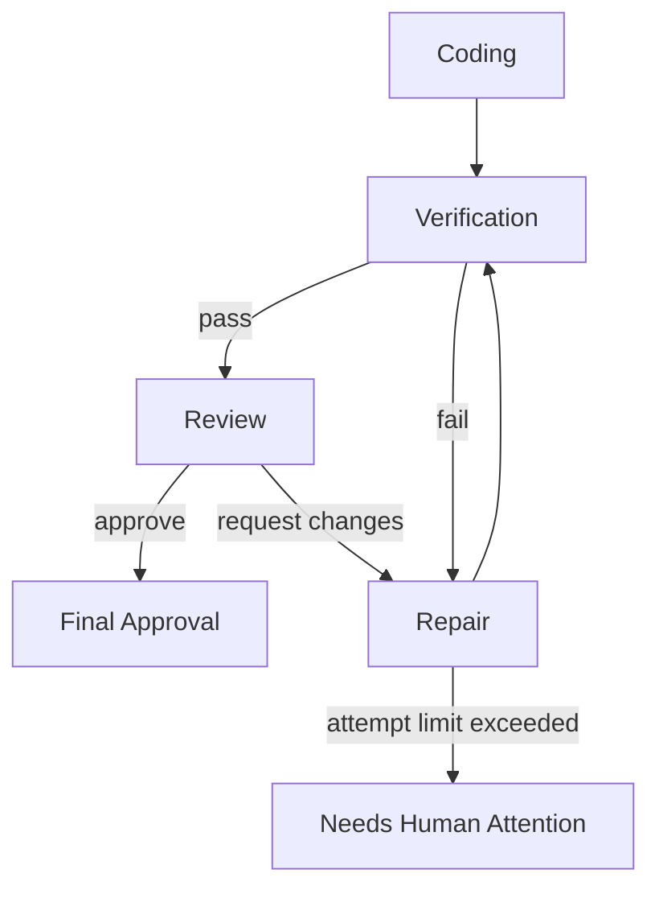
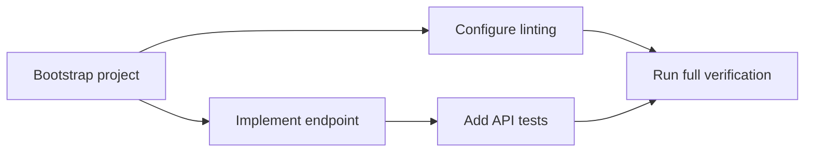

# Workflows

Version: 0.1

## Purpose

This document defines how Maestro models and executes Workflows.

A Workflow is a versioned declarative specification describing how an Execution progresses from Goal to terminal outcome.

A Workflow is not a prompt.

A Workflow is not an Agent conversation.

A Workflow is not the implementation of a workflow engine.

It is a desired-state graph that Maestro controllers reconcile.

## Kubernetes-Like Workflow Philosophy

Maestro does not ask a model to decide the entire control flow.

Instead:

1. the Workflow declares valid steps and transitions;
2. persisted resources represent desired and observed state;
3. controllers watch resources and reconcile them;
4. the scheduler assigns ready Work Items to Agents;
5. conditions and events record progress;
6. humans approve transitions at explicit gates.

```text
Desired state
    ↓
Reconciliation
    ↓
Observed state
    ↓
Events and Conditions
```

## Workflow Resource

```yaml
apiVersion: maestro.dev/v1alpha1
kind: Workflow
metadata:
  name: software-delivery
spec:
  version: v1
  entrypoint: planning
  steps:
    - id: planning
      type: role
      roleRef: planner
      onSuccess: plan-approval

    - id: plan-approval
      type: approval
      approvalPolicyRef: human-required
      onApproved: prepare-workspace
      onRejected: planning

    - id: prepare-workspace
      type: system
      controller: workspace
      onSuccess: execute-work-items

    - id: execute-work-items
      type: fanout
      source: approvedPlan.workItems
      onSuccess: verify

    - id: verify
      type: system
      controller: verification
      onSuccess: review
      onFailure: repair

    - id: review
      type: role
      roleRef: reviewer
      onApproved: final-approval
      onChangesRequested: repair

    - id: repair
      type: role
      roleRef: coder
      maxAttempts: 2
      onSuccess: verify

    - id: final-approval
      type: approval
      approvalPolicyRef: human-required
      onApproved: completed
      onRejected: cancelled

    - id: completed
      type: terminal
      outcome: success
```

## Workflow Resource Shape

```yaml
apiVersion: maestro.dev/v1alpha1
kind: Workflow
metadata:
  name: string
spec:
  version: string
  description: string
  entrypoint: string
  parameters: {}
  steps: []
  policies: {}
status:
  validation:
    valid: true
    errors: []
  conditions: []
```

Workflow definitions are immutable by version.

Editing a Workflow creates a new version.

Existing Executions continue using the version they started with unless explicitly migrated.

## Step Types

The MVP should support a small number of step types.

### Role Step

Schedules a Role invocation.

```yaml
- id: planning
  type: role
  roleRef: planner
  input:
    goalRef: execution.goal
  output:
    artifactType: plan
```

### System Step

Invokes a deterministic Maestro controller rather than a model.

Examples:

- prepare Workspace;
- collect Git diff;
- execute verification commands;
- persist an Artifact;
- clean up a Workspace.

```yaml
- id: verify
  type: system
  controller: verification
```

### Approval Step

Pauses until a human or policy decision is recorded.

```yaml
- id: plan-approval
  type: approval
  subjectRef: latestPlan
  requiredApprovers: 1
```

### Fan-Out Step

Creates Work Items from a list.

```yaml
- id: execute-work-items
  type: fanout
  source: approvedPlan.workItems
  roleField: roleRef
  maxParallel: 1
```

The MVP may execute sequentially even if the data model supports parallelism.

### Join Step

Waits for a set of Work Items.

```yaml
- id: wait-for-work
  type: join
  source: execution.workItems
  successPolicy: all
```

### Decision Step

Evaluates structured state using deterministic expressions.

```yaml
- id: route-review
  type: decision
  expression: review.status.verdict
  cases:
    Approve: final-approval
    RequestChanges: repair
    NeedsHumanDecision: final-approval
```

Decision steps must not contain arbitrary model reasoning.

### Terminal Step

Marks a terminal outcome.

```yaml
- id: failed
  type: terminal
  outcome: failure
```

## Workflow Instance

A Workflow definition is reusable.

An Execution creates a Workflow Instance by pinning:

```text
Workflow name
Workflow version
Execution ID
Input parameters
Policy references
```

The instance state is persisted as part of Execution status and checkpoints.

## Reconciliation Model

Each controller watches resources relevant to its responsibility.

Example controllers:

```text
ExecutionController
PlanController
ApprovalController
WorkspaceController
WorkItemController
VerificationController
ReviewController
FinalizationController
```

Controllers must be:

- idempotent;
- restart-safe;
- side-effect aware;
- optimistic-concurrency safe;
- deterministic given the same persisted state.

## Example Reconciliation Loop

```python
async def reconcile_execution(execution_id: UUID) -> None:
    execution = repository.get_execution(execution_id)

    if execution.status.phase == "Planning":
        ensure_planning_work_item(execution)

    elif execution.status.phase == "WaitingForPlanApproval":
        ensure_approval_request(execution)

    elif execution.status.phase == "PreparingWorkspace":
        ensure_workspace(execution)

    elif execution.status.phase == "Executing":
        ensure_ready_work_items_scheduled(execution)

    elif execution.status.phase == "Verifying":
        ensure_verification_run(execution)

    elif execution.status.phase == "Reviewing":
        ensure_review_work_item(execution)
```

The word `ensure` is important.

A controller should ensure the desired resource exists rather than blindly creating it.

## Workflow State Versus Execution Phase

Workflow state contains detailed step information.

Execution phase provides a concise user-facing summary.

Example:

```yaml
status:
  phase: Executing
  workflow:
    currentStep: execute-work-items
    stepStates:
      planning: Succeeded
      plan-approval: Succeeded
      prepare-workspace: Succeeded
      execute-work-items: Running
      verify: Pending
```

## Step State

```yaml
stepState:
  phase: Running
  attempt: 1
  startedAt: ...
  completedAt: null
  outputRefs: []
  conditions: []
```

Recommended phases:

```text
Pending
Ready
Running
Waiting
Succeeded
Failed
Skipped
Cancelled
```

## Transition Rules

Transitions occur only after persisted evidence exists.

Example:

```text
Coding Role says "done"
    ≠
Work Item Succeeded

Required evidence:
- Agent invocation completed
- structured output validated
- changed files collected
- required verification executed
- controller updated observed status
```

## Approval Gates

Approvals are first-class resources or records.

```yaml
apiVersion: maestro.dev/v1alpha1
kind: Approval
metadata:
  name: execution-123-plan
spec:
  executionRef: execution-123
  subjectRef: plan-2
  type: plan
  requiredApprovers: 1
status:
  phase: Pending
  decisions: []
```

Decision:

```yaml
status:
  phase: Approved
  decisions:
    - actor: user
      decision: approve
      comment: Proceed
      decidedAt: ...
```

### Approval Invariants

- Approval subjects are immutable Artifacts or resource versions.
- Approval decisions are attributable.
- Editing an approved subject invalidates the approval.
- Models cannot approve on behalf of humans unless a policy explicitly allows automated approval.
- MVP uses human approval for Plan and final result.

## Retry Model

Retries are workflow-owned.

Agents do not retry themselves indefinitely.

```yaml
retryPolicy:
  maxAttempts: 2
  retryOn:
    - ProviderUnavailable
    - InvalidStructuredOutput
    - TransientToolFailure
  doNotRetryOn:
    - PolicyDenied
    - HumanRejected
    - PathEscapeAttempt
```

Retry state is persisted.

Backoff may be introduced later.

## Repair Loop

The initial software-delivery Workflow supports a bounded repair loop.



The repair loop is bounded by Execution limits.

```yaml
limits:
  maxCodingIterations: 2
  maxReviewIterations: 2
```

## Work Item Dependency Graph

Plans may define dependencies.



Readiness rule:

```text
Work Item is Ready when:
- phase is Pending
- all dependencies are Succeeded
- owning Execution is active
- required Workspace is Ready
- required Role has at least one eligible Agent
- no approval gate blocks it
```

Dependency graphs must be acyclic.

## Scheduler Contract

The Workflow identifies which Role is needed.

The scheduler selects an Agent.

```text
Workflow:
  roleRef = backend-developer

Scheduler evaluates:
  Agent supports backend-developer
  Provider is Ready
  Required Capabilities are available
  Capacity is available
  Workspace locality is compatible
  Policy allows assignment
```

Workflow definitions must never hard-code an Agent ID.

## Event-Driven Progression

Each meaningful outcome emits an Event.

Example:

```text
AgentInvocationCompleted
    ↓
WorkItemController validates result
    ↓
WorkItemSucceeded
    ↓
ExecutionController reconciles
    ↓
ExecutionPhaseChanged
    ↓
Review Work Item created
```

Events trigger reconciliation but are not the sole source of truth.

Persisted resource state remains authoritative.

## Failure Taxonomy

Workflow behavior depends on structured failure types.

### User Failure

Examples:

- approval rejected;
- user cancelled;
- required clarification unanswered.

### Model Failure

Examples:

- invalid structured output;
- refusal;
- context window exceeded;
- tool-call protocol error.

### Provider Failure

Examples:

- unavailable endpoint;
- timeout;
- authentication failure;
- rate limit.

### Tool Failure

Examples:

- command failed;
- file not found;
- timeout;
- unsupported operation.

### Policy Failure

Examples:

- denied command;
- path traversal;
- prohibited Capability;
- secret access attempt.

### Verification Failure

Examples:

- tests failed;
- build failed;
- lint failed.

### System Failure

Examples:

- persistence unavailable;
- Workspace creation failed;
- corrupted Artifact.

Failures must be represented in status and Events.

## Compensation and Cleanup

Some steps produce external side effects.

Examples:

- create Git worktree;
- create temporary branch;
- start container;
- allocate remote worker.

Workflows may declare cleanup behavior.

```yaml
cleanup:
  always:
    - workspace.release-lock
  onFailure:
    - workspace.preserve-for-debugging
  onSuccess:
    - workspace.mark-ready-for-acceptance
```

MVP should preserve failed Workspaces for inspection and require explicit cleanup.

## Cancellation

Cancellation is a desired-state change.

```yaml
spec:
  cancellationRequested: true
```

Controllers reconcile toward cancellation:

1. stop scheduling new Work Items;
2. request cancellation of active Agent invocations;
3. terminate allowed subprocesses;
4. collect final logs;
5. mark remaining Work Items cancelled;
6. set Execution phase to `Cancelled`.

Cancellation must be idempotent.

## Pause and Resume

The model supports future pause/resume.

```yaml
spec:
  suspended: true
```

MVP may omit UI controls while retaining the field in the conceptual design.

## Workflow Validation

Before registration, Maestro validates:

- unique step IDs;
- valid entrypoint;
- referenced transitions exist;
- terminal states are reachable;
- dependency graph is acyclic;
- Role references exist;
- decision cases are complete or have defaults;
- retry limits are finite;
- approval steps reference valid subjects;
- Workflow version is immutable.

## Default MVP Workflow

```yaml
apiVersion: maestro.dev/v1alpha1
kind: Workflow
metadata:
  name: software-delivery
spec:
  version: v1alpha1
  entrypoint: planning
  steps:
    - id: planning
      type: role
      roleRef: planner
      onSuccess: plan-approval

    - id: plan-approval
      type: approval
      subjectRef: latestPlan
      onApproved: prepare-workspace
      onRejected: planning

    - id: prepare-workspace
      type: system
      controller: workspace
      onSuccess: execute-work-items

    - id: execute-work-items
      type: fanout
      source: approvedPlan.workItems
      maxParallel: 1
      onSuccess: verify

    - id: verify
      type: system
      controller: verification
      onSuccess: review
      onFailure: repair

    - id: review
      type: role
      roleRef: reviewer
      onApproved: final-approval
      onChangesRequested: repair
      onNeedsHumanDecision: final-approval

    - id: repair
      type: role
      roleRef: coder
      maxAttempts: 2
      onSuccess: verify
      onFailure: needs-attention

    - id: final-approval
      type: approval
      subjectRef: finalArtifacts
      onApproved: completed
      onRejected: cancelled

    - id: needs-attention
      type: terminal
      outcome: failure

    - id: completed
      type: terminal
      outcome: success

    - id: cancelled
      type: terminal
      outcome: cancelled
```

## Workflow Evolution

Workflow definitions are versioned.

```text
software-delivery/v1alpha1
software-delivery/v1alpha2
software-delivery/v1
```

Existing Executions remain pinned.

Migration is explicit and creates an audit Event.

## Observability

Workflow status should expose:

- current step;
- step attempt;
- active Work Items;
- waiting reason;
- next expected transition;
- last Event;
- elapsed time;
- retry counts;
- policy decisions.

## Testing Workflows

### Static Tests

- schema validation;
- transition validity;
- unreachable steps;
- cycle detection;
- missing Role references.

### Controller Tests

- idempotent reconciliation;
- duplicate event handling;
- restart recovery;
- optimistic concurrency conflict.

### Scenario Tests

```gherkin
Given an Execution in Planning
And no planning Work Item exists
When the controller reconciles twice
Then exactly one planning Work Item exists
```

```gherkin
Given an approved Plan
And a Ready Workspace
When all coding Work Items succeed
Then the Execution transitions to Verifying
```

```gherkin
Given a Review requesting changes
And the repair limit has not been reached
Then one repair Work Item is created
```

## Workflow Invariants

```yaml
invariants:
  - Workflow definitions are immutable by version
  - Executions pin one Workflow version
  - Controllers are idempotent
  - Models never choose arbitrary next states
  - Role steps reference Roles, not Agents
  - Approval subjects are immutable
  - Retries are finite
  - Repair loops are bounded
  - Every transition has persisted evidence
  - Every state change emits an Event
  - Terminal states do not transition implicitly
```

## Design Decisions

- Workflow definitions are declarative resources.
- Controllers reconcile desired and observed state.
- Events trigger reconciliation but persisted resources remain authoritative.
- Role selection and Agent scheduling are separate concerns.
- Human approval is represented explicitly.
- Repair loops are bounded.
- Workflow versions are immutable.
- The MVP uses one default Workflow but the core is designed for multiple Workflow definitions.

## Open Questions

- Should Workflow definitions be stored in YAML, the database, or both?
- Should expression evaluation use a restricted language such as CEL?
- Should the MVP support fan-out internally while executing sequentially?
- How should Workflow migrations be represented?
- Should cleanup be part of the Workflow graph or controlled by finalizers?
- Should approvals be generic resources or Execution subresources?

## Future Evolution

- Parallel Work Items.
- Reusable sub-workflows.
- Conditional Work Item generation.
- Policy-driven automatic approvals.
- Distributed controllers.
- Workflow templates and parameters.
- Visual Workflow editor.
- Server-side validation and admission policies.
- Workflow replay from an Event boundary.
- Cron and event-triggered Executions.
- Multi-project Workflows.
