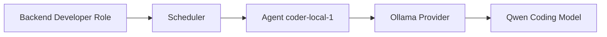
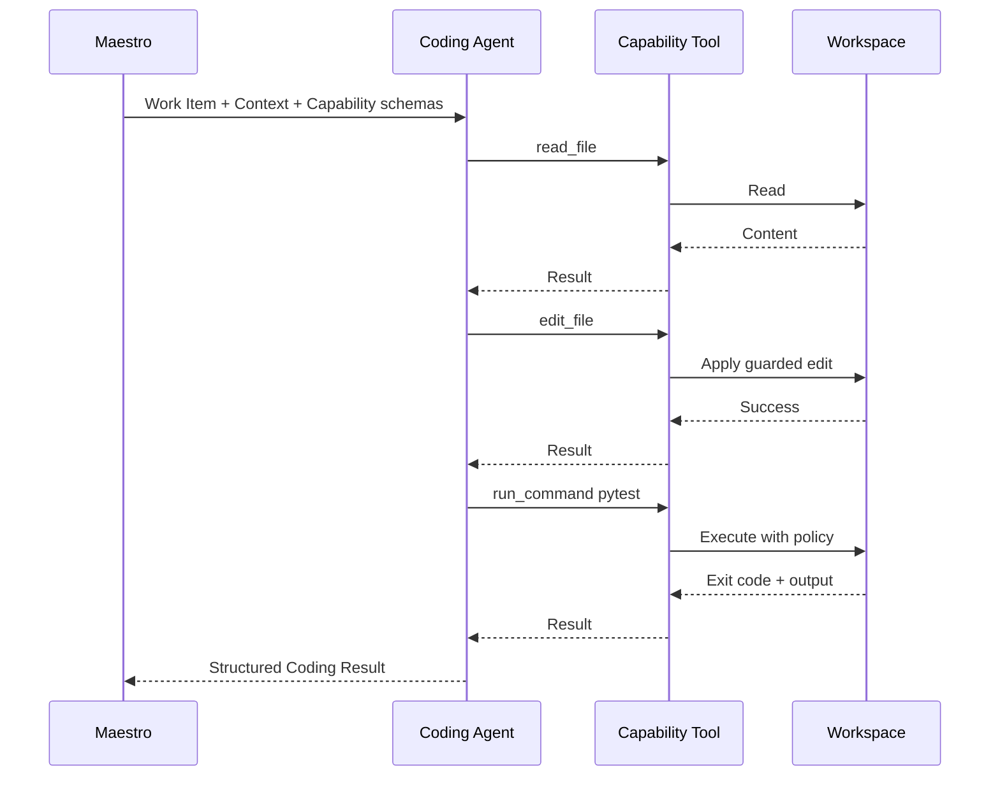

# Roles

Version: 0.1

## Purpose

This document defines Maestro's Role model.

A Role describes a specialized responsibility within a Workflow.

A Role is not a model.

A Role is not a provider.

A Role is not a prompt alone.

A Role is a versioned declarative contract defining:

- purpose;
- accepted input;
- required output;
- permitted Capabilities;
- prohibited actions;
- execution policy;
- quality expectations.

Agents fulfill Roles at runtime.

## Role Versus Agent

```text
Role:
  What responsibility must be fulfilled?

Agent:
  Which runtime instance will fulfill it now?

Provider:
  How is the model accessed?

Model:
  Which language model performs reasoning?
```

Example:



The Workflow references the Role.

The scheduler selects the Agent.

## Role Resource

```yaml
apiVersion: maestro.dev/v1alpha1
kind: Role
metadata:
  name: backend-developer
  labels:
    domain: software-engineering
spec:
  version: v1alpha1
  purpose: Implement backend Work Items
  inputSchemaRef: BackendWorkItemInput/v1
  outputSchemaRef: CodingResult/v1
  requiredCapabilities:
    - filesystem.read
    - filesystem.write
    - filesystem.edit
    - git.status
    - git.diff
  optionalCapabilities:
    - shell.execute.test
    - shell.execute.build
    - knowledge.search
  prohibitedCapabilities:
    - git.push
    - deployment.execute
    - secrets.read
  executionPolicy:
    maxSteps: 40
    maxDurationSeconds: 1800
    requireStructuredOutput: true
    requireIndependentVerification: true
status:
  phase: Ready
  validation:
    valid: true
```

## Role Anatomy

### Identity

```yaml
metadata:
  name: planner
spec:
  version: v1alpha1
```

Role identity is the pair:

```text
name + version
```

### Purpose

A concise statement of responsibility.

Bad:

```text
Help the user with software.
```

Good:

```text
Transform a Goal and project context into a structured, reviewable Plan.
```

### Input Contract

Defines exactly what the Role receives.

### Output Contract

Defines the schema Maestro expects.

### Capability Policy

Defines required, optional, and prohibited Capabilities.

### Execution Policy

Defines limits, validation, and quality constraints.

### Prompt Template

A prompt template may support the Role but does not define the Role by itself.

Prompt templates are versioned artifacts associated with Role versions.

## Role Invariants

- A Role has one primary responsibility.
- A Role does not reference a specific model.
- A Role does not schedule other Roles.
- A Role does not mutate Workflow state directly.
- A Role cannot grant itself Capabilities.
- Role input and output are schema-validated.
- Role versions are immutable.
- Workflows reference Role versions or compatible version ranges.
- Role output is untrusted until Maestro validates it.

## MVP Roles

The MVP includes three Roles:

```text
Planner
Coding
Reviewer
```

Future versions may split Coding into Frontend Developer and Backend Developer Roles.

## Planner Role

### Responsibility

Transform a human Goal and explicit project context into a structured Plan containing small, executable Work Items.

### Non-Responsibility

The Planner does not:

- modify files;
- execute commands;
- create branches;
- run tests;
- approve its own Plan;
- schedule Agents;
- decide Workflow transitions;
- silently change the Goal.

### Planner Input

```yaml
goal:
  summary: string
  description: string
  constraints: [string]
  acceptanceCriteria: [string]

project:
  name: string
  repositories:
    - id: string
      summary: string

repositoryContext:
  trees: []
  readmeArtifacts: []
  instructionArtifacts: []

knowledgeContext:
  results: []

workflowContext:
  permittedRoleRefs: []
  policySummary: string
```

### Planner Output

```yaml
summary: string
assumptions:
  - string
questions:
  - id: string
    question: string
    blocking: boolean
risks:
  - description: string
    mitigation: string
workItems:
  - id: string
    title: string
    roleRef: string
    repositoryRef: string
    objective: string
    contextRefs: []
    constraints: []
    acceptanceCriteria: []
    verification:
      commands: []
    dependsOn: []
```

### Planner Capabilities

Required:

```text
repository.structure.read
artifact.read
knowledge.search
```

Optional:

```text
web.search
```

Prohibited:

```text
filesystem.write
filesystem.edit
shell.execute
git.commit
git.push
approval.decide
workflow.transition
```

### Planner Quality Rules

- Ask only blocking or high-value questions.
- Prefer small Work Items.
- Each Work Item must be independently verifiable.
- Each Work Item must reference one Role.
- Every Work Item must include acceptance criteria.
- Dependencies must be explicit.
- Plans must not assume tools or permissions unavailable to the assigned Role.
- Plans must state material assumptions.

### Planner Conditions

Possible Role result conditions:

```text
PlanReady
NeedsUserInput
UnableToPlan
```

### Planner Example

Input Goal:

```text
Create a minimal FastAPI health endpoint.
```

Output:

```yaml
summary: Add a minimal application skeleton and health endpoint
assumptions:
  - Python 3.12 is available
questions: []
risks:
  - description: Repository is empty
    mitigation: Bootstrap only the minimum project structure
workItems:
  - id: bootstrap
    title: Bootstrap FastAPI project
    roleRef: coding
    repositoryRef: backend
    objective: Create the minimal application and test structure
    acceptanceCriteria:
      - Application imports successfully
      - pytest runs
    verification:
      commands:
        - pytest
    dependsOn: []

  - id: health-endpoint
    title: Implement health endpoint
    roleRef: coding
    repositoryRef: backend
    objective: Implement GET /health
    acceptanceCriteria:
      - GET /health returns 200
      - Response equals {"status":"ok"}
    verification:
      commands:
        - pytest
    dependsOn:
      - bootstrap
```

## Coding Role

### Responsibility

Implement one Work Item inside an assigned Workspace using only granted Capabilities.

### Non-Responsibility

The Coding Role does not:

- change the Goal;
- modify the Plan;
- schedule additional Work Items;
- choose the next Workflow state;
- approve its own output;
- push or merge unless explicitly granted;
- access paths outside its Workspace;
- access secrets by default.

### Coding Input

```yaml
executionRef: UUID
workItem:
  id: string
  objective: string
  constraints: []
  acceptanceCriteria: []
  verification:
    commands: []

workspace:
  id: UUID
  root: string
  repositoryRef: string
  baseRevision: string

context:
  instructionArtifactRefs: []
  knowledgeArtifactRefs: []
  priorReviewRefs: []

capabilities:
  granted: []
  denied: []

limits:
  maxSteps: integer
  maxDurationSeconds: integer
  maxCommandOutputBytes: integer
```

### Coding Output

```yaml
status: completed | blocked | failed
summary: string
changedFiles:
  - path: string
    changeType: added | modified | deleted
commandsRequested:
  - command: string
    purpose: string
remainingIssues:
  - string
questions:
  - string
```

The Coding Role does not authoritatively report test success.

Maestro independently records command exit codes and creates verification Artifacts.

### Coding Capabilities

Required:

```text
filesystem.read
filesystem.write
filesystem.edit
git.status
git.diff
```

Optional:

```text
shell.execute.test
shell.execute.build
knowledge.search
web.search
```

Prohibited by default:

```text
filesystem.read.outside-workspace
git.push
git.merge
deployment.execute
secrets.read
sudo
network.unrestricted
workflow.transition
approval.decide
```

### Coding Quality Rules

- Inspect relevant files before editing.
- Make the smallest change satisfying the Work Item.
- Preserve existing architecture and style.
- Avoid unrelated refactors.
- Never claim a file exists without verification.
- Never claim tests passed without observed tool output.
- Stop and report when required information or permissions are missing.
- Treat `AGENTS.md` or project instructions as binding.
- Do not weaken tests to make them pass unless the Work Item explicitly requires test changes.

### Coding Tool Loop



### Coding Conditions

```text
ImplementationProduced
BlockedByMissingContext
BlockedByPolicy
ToolFailure
UnableToComplete
```

## Reviewer Role

### Responsibility

Evaluate immutable implementation Artifacts against the Goal, approved Plan, Work Item acceptance criteria, project instructions, and verification evidence.

### Non-Responsibility

The Reviewer does not:

- modify files;
- run unrestricted shell commands;
- repair code;
- schedule a repair;
- approve on behalf of the human;
- change acceptance criteria;
- review hidden unrecorded state.

### Reviewer Input

```yaml
goalRef: artifact://goal
planRef: artifact://approved-plan
workItemRef: UUID
subjectArtifacts:
  - artifact://git-diff
  - artifact://verification-report
  - artifact://coding-summary
projectInstructionRefs:
  - artifact://agents-md
reviewPolicy:
  securityChecks: true
  requireTests: true
```

### Reviewer Output

```yaml
verdict: Approve | RequestChanges | NeedsHumanDecision | UnableToReview
summary: string
blockingFindings:
  - id: string
    severity: critical | high | medium | low
    category: correctness | security | maintainability | tests | scope
    file: string | null
    line: integer | null
    issue: string
    evidence: string
    suggestedFix: string
nonBlockingFindings:
  - ...
missingEvidence:
  - string
```

### Reviewer Capabilities

Required:

```text
artifact.read
repository.read
git.diff.read
knowledge.search
```

Optional:

```text
shell.execute.readonly
web.search
```

Prohibited:

```text
filesystem.write
filesystem.edit
git.commit
git.push
deployment.execute
workflow.transition
approval.decide
```

### Reviewer Quality Rules

- Review against explicit acceptance criteria.
- Distinguish blocking from non-blocking findings.
- Cite evidence.
- Avoid broad redesign requests unrelated to the Work Item.
- Do not reject solely for stylistic preference when project conventions are satisfied.
- Mark missing evidence explicitly.
- Return `NeedsHumanDecision` for policy or architectural ambiguity.
- Never edit the implementation.

### Reviewer Verdict Semantics

#### Approve

No blocking findings remain and evidence is sufficient.

#### RequestChanges

At least one blocking finding can be addressed by the Coding Role.

#### NeedsHumanDecision

The issue requires product, architectural, security, or policy ownership.

#### UnableToReview

Required Artifacts are missing or unreadable.

## Future Roles

### Frontend Developer

Specializes in UI, accessibility, state management, frontend tests, and client-side integration.

### Backend Developer

Specializes in APIs, persistence, business logic, server-side security, and backend tests.

### Researcher

Produces sourced Knowledge Artifacts without modifying project files.

### Documentation Writer

Produces documentation Artifacts from approved implementation state.

### Security Reviewer

Performs security-focused evaluation with stricter policy.

### Release Manager

Prepares release notes and packaging but does not deploy without approval.

## Role Compatibility

Agents declare supported Role versions.

```yaml
supportedRoles:
  - name: coding
    versions:
      - v1alpha1
```

The scheduler must verify:

- Role compatibility;
- required Capabilities;
- provider health;
- model suitability;
- available capacity;
- Workspace compatibility;
- policy compliance.

## Role Binding

Projects bind logical Roles to Agent selectors.

```yaml
roleBindings:
  planner:
    selector:
      matchLabels:
        capability: reasoning
        locality: macbook
  coding:
    selector:
      matchLabels:
        capability: coding
        locality: desktop
  reviewer:
    selector:
      matchLabels:
        provider: codex
```

MVP may bind directly by Agent name while preserving selector-compatible configuration.

## Role Versioning

Role contracts evolve through versions.

```text
planner/v1alpha1
planner/v1alpha2
planner/v1
```

Breaking changes require a new version.

Prompt changes that alter behavior materially should increment the Role version or prompt artifact version.

Executions record the exact Role and prompt versions used.

## Prompt Construction

A prompt is assembled from:

```text
Role policy
+
Role-specific instructions
+
Work Item or Goal
+
Explicit context
+
Capability descriptions
+
Output schema
+
Execution limits
```

Prompts should not include unrelated hidden memory.

## Role Invocation

A Role invocation is a durable record.

```yaml
apiVersion: maestro.dev/v1alpha1
kind: RoleInvocation
metadata:
  name: invocation-123
spec:
  executionRef: execution-123
  workItemRef: implement-health
  roleRef:
    name: coding
    version: v1alpha1
  agentRef: coder-local
  inputArtifactRefs: []
  grantedCapabilities: []
status:
  phase: Succeeded
  startedAt: ...
  completedAt: ...
  outputArtifactRefs: []
  tokenUsage: {}
```

## Role Invocation Phases

```text
Pending
Assigned
Running
WaitingForTool
Succeeded
Failed
Cancelled
TimedOut
```

## Capability Admission

Before invoking an Agent, Maestro computes effective Capabilities.

```text
Role required Capabilities
+
Project policy
+
Workflow policy
+
Workspace policy
+
Agent implementation support
-
Denied Capabilities
=
Effective Capabilities
```

If required Capabilities cannot be granted, scheduling fails before model invocation.

## Role Admission Checks

- Role exists and version is valid.
- Input validates against schema.
- Output schema is available.
- Required Capabilities can be granted.
- Agent supports the Role.
- Execution limits are finite.
- Prompt template is available.
- Provider is Ready.
- Workspace is Ready when required.

## Role Result Validation

Maestro validates:

- schema;
- enum values;
- references;
- path boundaries;
- Work Item identity;
- allowed result type;
- output size;
- presence of required fields.

Invalid output may trigger one bounded repair request to the same Agent.

Repeated invalid output becomes a Role invocation failure.

## Roles and Knowledge

Roles request Knowledge through Capabilities.

They do not connect directly to NAS, Odysseus, Confluence, or other systems.

```text
Role requests knowledge.search
    ↓
Knowledge Capability
    ↓
Knowledge Provider
    ↓
Knowledge Result Artifact
```

This keeps Roles source-agnostic.

## Roles and Memory

Persistent memory belongs to Maestro.

A Role invocation may receive selected Memory or Knowledge Artifacts.

The Agent does not own long-term memory.

Future memory features must remain explicit, queryable, and attributable.

## Role Testing

### Contract Tests

- valid input accepted;
- invalid input rejected;
- output schema enforced;
- prohibited Capability cannot be granted.

### Prompt Evals

- Planner produces bounded Work Items;
- Coder stays within scope;
- Reviewer distinguishes blocking and non-blocking findings.

### Policy Tests

```gherkin
Given the Planner Role
When effective Capabilities are computed
Then filesystem.write is denied
And shell.execute is denied
```

```gherkin
Given the Reviewer Role
When it returns RequestChanges
Then no Workspace files have changed
```

### Provider Compatibility Tests

The same Role test suite should run against multiple Agents and models.

## Role Invariants

```yaml
invariants:
  - Role defines responsibility, not runtime
  - Role versions are immutable
  - Workflow references Role, not Agent
  - Agent is selected by scheduler
  - Role cannot schedule another Role
  - Role cannot mutate Workflow state
  - Role cannot grant itself Capabilities
  - Planner cannot modify Workspace files
  - Coding Role cannot approve its own work
  - Reviewer cannot modify code
  - Every invocation has validated input and output
  - Every invocation records Agent, Provider, Model, Role version, and prompt version
```

## Design Decisions

- Role is a first-class versioned resource.
- Agent is a runtime instance, not a domain responsibility.
- Roles use structured input and output contracts.
- Capabilities define permissions.
- Workflows reference Roles.
- Scheduler selects Agents.
- The MVP starts with Planner, Coding, and Reviewer.
- Role invocations are durable auditable resources.

## Open Questions

- Should Roles be fully user-definable in the MVP or shipped as built-ins?
- Should prompt templates be embedded in Role resources or referenced as Artifacts?
- Should an Agent support multiple Role versions simultaneously?
- Should model suitability be declared manually or evaluated?
- Should project-specific Role overlays be supported?
- Should read-only shell execution be available to Reviewer in the MVP?

## Future Evolution

- Role inheritance or composition.
- Organization-level Role catalogs.
- Role admission policies.
- Dynamic Agent pools.
- Specialized Frontend and Backend Roles.
- Multi-model ensembles fulfilling one Role.
- Role quality scores and scheduling preferences.
- Capability negotiation.
- Marketplace for signed Role packages.
- Formal evaluation suites per Role version.
