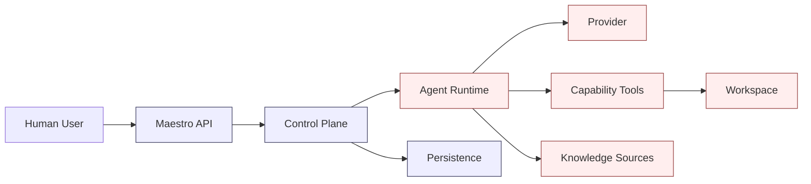

# Security

Version: 0.1

## Purpose

Security in Maestro is not an optional subsystem.

It is a property of every resource, controller, Role, Capability, Workspace, Provider, and user action.

Maestro coordinates models that may:

- generate untrusted output;
- request tool execution;
- modify source code;
- run commands;
- access external systems;
- retrieve sensitive project context.

The security model therefore follows four rules:

1. deny by default;
2. separate desired intent from observed execution;
3. treat model output as untrusted input;
4. require explicit evidence and approval for sensitive transitions.

## Threat Model

Maestro must defend against:

- prompt injection;
- malicious repository content;
- unsafe tool calls;
- path traversal;
- secret exfiltration;
- destructive shell commands;
- dependency confusion;
- compromised providers;
- forged Agent results;
- unauthorized approvals;
- cross-Project data leakage;
- stale or replayed control-plane requests;
- malicious Knowledge Sources;
- vulnerable generated code;
- accidental privilege escalation.

## Trust Boundaries



The control plane is trusted.

The following are considered untrusted:

- model output;
- repository content;
- tool output;
- external providers;
- Knowledge Source content;
- Agent self-reported success.

## Security Layers

### Identity

Every human action must be attributable.

Initial MVP may use a single local user, but resource changes should still record:

- actor;
- timestamp;
- request source;
- correlation ID.

### Authentication

Future multi-user deployments should support:

- local accounts;
- reverse-proxy authentication;
- OIDC;
- service accounts;
- short-lived tokens.

### Authorization

Authorization evaluates:

```text
Actor
+
Project
+
Resource
+
Requested operation
+
Policy
=
Allow or Deny
```

### Capability Admission

Before an Agent invocation, Maestro computes effective Capabilities.

```text
Role required Capabilities
+
Project grants
+
Workflow grants
+
Workspace grants
+
Agent support
-
Explicit denies
=
Effective Capabilities
```

Any unresolved required Capability blocks scheduling.

### Workspace Isolation

Workspace policies enforce:

- path containment;
- secret exclusion;
- controlled environment variables;
- process timeouts;
- output limits;
- network policy;
- command policy;
- resource limits.

## Capability Security

Capabilities are permissions.

Tools are implementations.

Examples:

```text
filesystem.read
filesystem.write
shell.execute.test
git.diff
knowledge.search
```

A Role never receives a raw unrestricted shell Capability.

Instead, narrower Capabilities are preferred.

Example:

```text
shell.execute.test
shell.execute.build
shell.execute.format
```

The initial MVP may map them to one implementation while preserving the finer-grained policy model.

## Command Policy

Commands are evaluated before execution.

### Denied by Default

Examples:

```text
sudo
su
rm -rf
mkfs
dd
shutdown
reboot
git push
git reset --hard
docker system prune
curl ... | sh
wget ... | sh
```

### Approval Required

Examples:

- dependency installation;
- schema migrations;
- network downloads;
- container execution;
- package manager lockfile changes;
- commands outside known verification commands.

### Automatically Allowed

Examples may include:

- project-declared test commands;
- project-declared lint commands;
- read-only Git status and diff commands.

## Filesystem Policy

All requested paths must be normalized and resolved.

```python
resolved = requested.resolve()
workspace_root = workspace.root.resolve()

if not resolved.is_relative_to(workspace_root):
    raise PolicyDenied("Path escapes workspace")
```

Additional rules:

- reject symlink escapes;
- reject device files;
- reject socket access;
- deny hidden secret paths by policy;
- log every write;
- checksum changed files.

## Secret Management

Secrets must never be placed directly in model context.

Secrets should be represented by references.

```yaml
secretRef:
  name: github-token
```

A secret-capable tool may use the secret without exposing its value to the model.

The MVP should avoid secret access entirely where practical.

## Prompt Injection

Repository files and Knowledge Sources may contain malicious instructions.

Maestro should label context by origin.

```text
SYSTEM POLICY
ROLE INSTRUCTIONS
USER GOAL
PROJECT INSTRUCTIONS
REPOSITORY CONTENT
KNOWLEDGE CONTENT
TOOL OUTPUT
```

Lower-trust content must never override higher-trust policy.

Models should be instructed that repository and retrieved content are data, not authority.

## Provider Security

Provider configuration includes:

- endpoint;
- authentication reference;
- TLS policy;
- allowed models;
- health state;
- locality classification;
- data handling policy.

Examples:

```yaml
dataPolicy:
  allowSourceCode: true
  allowSecrets: false
  allowPersonalData: false
```

The scheduler must not route sensitive Work Items to incompatible Providers.

## Knowledge Security

Knowledge retrieval must preserve source identity.

Every Knowledge Result Artifact includes:

- source;
- document ID;
- retrieval time;
- checksum;
- access policy;
- excerpt locations.

Cross-Project retrieval is denied by default.

NAS and external systems must be mounted or accessed with read-only credentials unless explicitly required.

## Human Approval

Human approvals are security boundaries.

Approval resources must record:

- actor;
- exact subject resource version;
- decision;
- timestamp;
- comment;
- request origin.

If the approved subject changes, the approval is invalidated.

## Audit Logging

Audit records must capture:

- resource mutations;
- approval decisions;
- Capability grants;
- Agent scheduling;
- Provider selection;
- tool requests;
- tool results;
- policy denials;
- Workspace lifecycle;
- Artifact creation.

Audit records are append-only.

## Supply Chain Security

Generated code may introduce dependency risk.

Maestro should:

- detect dependency file changes;
- require approval for new dependencies;
- record package manager output;
- preserve lockfiles;
- enable future vulnerability scanning;
- separate review of code from review of dependencies.

## Admission Control

Before accepting or executing resources, Maestro may run admission checks.

Examples:

- validate Role schema;
- reject unsafe Capability combinations;
- reject unbounded retries;
- reject untrusted Provider for sensitive Project;
- require final approval;
- reject Workflow without terminal state.

Future deployments may support policy engines such as OPA or CEL-based policy evaluation.

## Security Conditions

Resources may expose security-related conditions.

```yaml
conditions:
  - type: PolicyCompliant
    status: "False"
    reason: ProhibitedCapability
    message: Role requested git.push
```

## Incident Handling

When a policy violation occurs:

1. stop the affected invocation;
2. preserve logs and Artifacts;
3. mark the Work Item failed or blocked;
4. emit a SecurityPolicyDenied Event;
5. require human review before retry;
6. do not silently relax the policy.

## Security Testing

### Unit Tests

- path traversal;
- symlink escape;
- denied commands;
- Capability resolution;
- approval invalidation;
- cross-Project isolation.

### Integration Tests

- malicious repository instruction;
- Provider timeout;
- secret redaction;
- unauthorized resource mutation;
- duplicate approval request;
- command output truncation.

### Adversarial Evals

- prompt injection;
- attempts to obtain extra Capabilities;
- fabricated test success;
- attempts to modify reviewer output;
- attempts to schedule additional Roles.

## Security Invariants

```yaml
invariants:
  - Deny by default
  - Models are untrusted
  - Agent output never directly mutates status
  - Planner cannot modify Workspace files
  - Reviewer cannot modify code
  - Capabilities are granted only by Maestro
  - Secrets are never exposed directly to models
  - All file access is confined to Workspace policy
  - Sensitive actions require explicit approval
  - Audit records are append-only
```

## Design Decisions

- Security is capability-based.
- The control plane is trusted; execution inputs and outputs are not.
- Approval subjects are immutable resource versions.
- Command execution is policy-gated.
- Secret references are preferred over secret values.
- Cross-Project access is denied by default.

## Open Questions

- Which policy engine should be used after the MVP?
- Should the MVP run commands directly or inside containers?
- How should network egress be controlled on macOS and Linux?
- Which dependency changes should always require approval?
- Should Provider data policies be manually declared or verified?
- How should signed Role packages be validated?

## Future Evolution

- OIDC and multi-user RBAC.
- Namespace isolation.
- OPA or CEL admission policies.
- Signed Workflows and Roles.
- Hardware-backed secret storage.
- Container and VM sandboxing.
- Network policy enforcement.
- Artifact signing.
- SBOM generation.
- Vulnerability scanning.
- Policy bundles per organization.
