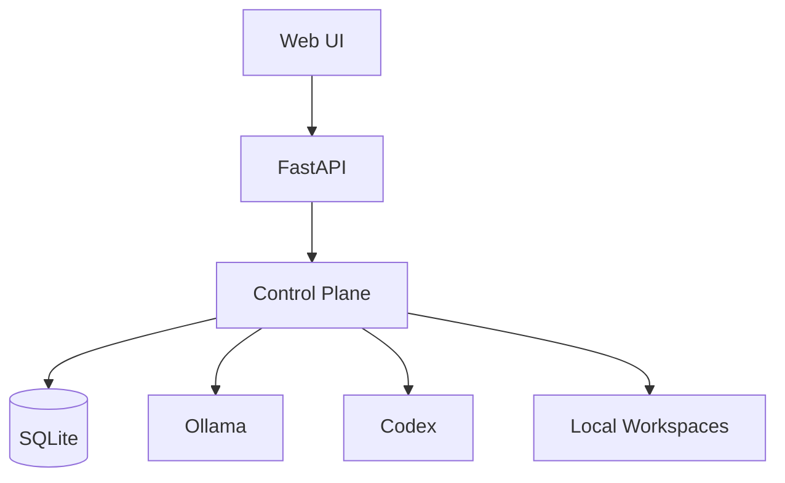
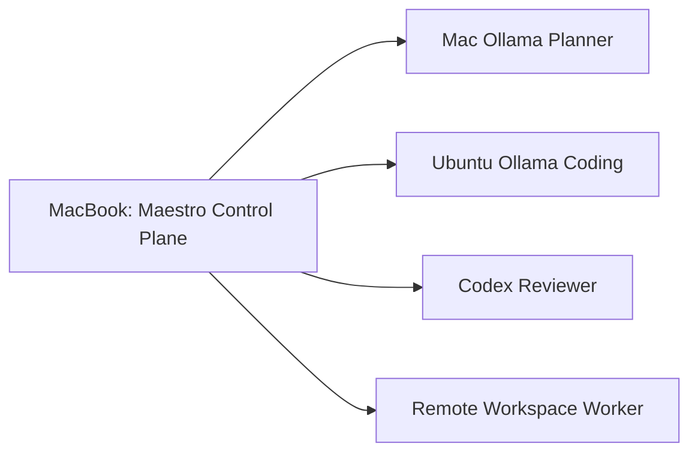
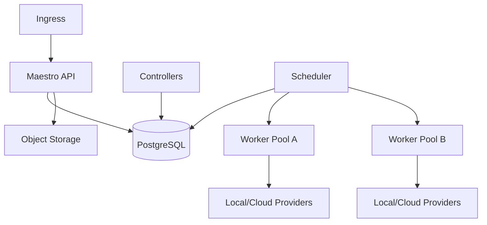

# Deployment

Version: 0.1

## Purpose

This document defines Maestro deployment topologies from the local MVP to a distributed control plane.

The MVP is local-first and should run on a single developer machine.

The architecture must allow later distribution without changing the domain model.

## MVP Topology



Components:

- FastAPI application;
- web UI;
- Workflow controllers;
- scheduler;
- SQLite;
- local Artifact storage;
- Ollama adapter;
- Codex adapter;
- local Git worktree Workspace provider.

## Recommended MVP Host

A single Linux or macOS host.

Example:

```text
MacBook Pro M4
  ├── Maestro
  ├── Ollama Planner
  ├── Ollama Coding Model
  ├── Codex Reviewer
  └── Local Git Workspaces
```

## Split Local-Lab Topology



The control plane remains on the Mac.

The Ubuntu desktop provides:

- coding inference;
- remote Workspace execution;
- larger storage;
- optional container runtime.

## Control Plane and Worker Separation

### Control Plane

Owns:

- API;
- resources;
- reconciliation;
- scheduling;
- policy;
- Events;
- approvals;
- persistence.

### Worker

Owns:

- Agent execution;
- Workspace operations;
- command execution;
- Artifact upload;
- local Provider access.

Workers do not own Workflow state.

## Configuration

Recommended environment variables:

```text
MAESTRO_DATABASE_URL
MAESTRO_ARTIFACT_ROOT
MAESTRO_WORKSPACE_ROOT
MAESTRO_LOG_LEVEL
MAESTRO_BIND_ADDRESS
MAESTRO_PORT
```

Provider and Project configuration should be stored as resources rather than only environment variables.

## Storage

### SQLite

Appropriate for:

- local MVP;
- one process;
- one user;
- moderate Execution history.

### PostgreSQL

Recommended for:

- multiple API instances;
- distributed controllers;
- concurrent users;
- larger Event volume.

### Artifact Storage

MVP:

```text
local filesystem
```

Future:

```text
NAS
S3-compatible object storage
```

Metadata remains in the database.

## Process Model

MVP may run as one process with internal async workers.

```text
maestro serve
```

Later process separation:

```text
maestro-api
maestro-controller
maestro-scheduler
maestro-worker
```

## Service Management

### macOS

Possible options:

- foreground development process;
- `launchd`;
- container runtime.

### Linux

Recommended:

- systemd;
- Docker Compose for evaluation;
- Kubernetes for larger deployments.

## Networking

Default bind:

```text
127.0.0.1
```

Remote access should use:

- Tailscale;
- VPN;
- authenticated reverse proxy.

Do not expose raw Ollama or Workspace worker ports publicly.

## TLS

Local-only MVP may run HTTP on loopback.

Remote deployments should terminate TLS at:

- reverse proxy;
- ingress controller;
- service mesh.

## Backup

Back up:

- database;
- Artifact storage;
- Role and Workflow packages;
- configuration;
- prompt versions.

Workspaces are generally reproducible and need not be backed up unless preserving failed execution state.

## Upgrade Strategy

Migrations must be explicit.

Upgrade sequence:

1. backup database;
2. validate configuration;
3. run schema migration;
4. start new control plane;
5. reconcile resources;
6. verify controllers;
7. retire old version.

Execution resources remain pinned to Workflow and Role versions.

## Development Environment

Suggested commands:

```bash
uv sync
uv run maestro serve
uv run pytest
uv run ruff check .
```

## Docker Compose Topology

Potential future development stack:

```yaml
services:
  maestro:
    build: .
    ports:
      - "7860:7860"
    volumes:
      - ./data:/var/lib/maestro
      - /var/run/docker.sock:/var/run/docker.sock

  postgres:
    image: postgres
```

Mounting the Docker socket carries significant risk and should not be the default secure deployment.

## Kubernetes Topology

Future production architecture:



Potential Kubernetes resources:

- API Deployment;
- Controller Deployment;
- Scheduler Deployment;
- Worker DaemonSet or Deployment;
- PostgreSQL;
- object storage;
- secrets;
- NetworkPolicies;
- persistent volumes.

## Worker Registration

Future workers register operational status.

```yaml
apiVersion: maestro.dev/v1alpha1
kind: Worker
metadata:
  name: ubuntu-desktop
spec:
  endpoint: ...
  labels:
    gpu: nvidia
    locality: home-lab
    os: linux
status:
  phase: Ready
  capacity:
    maxConcurrentAssignments: 2
```

## Scheduling Considerations

Scheduler may consider:

- Role compatibility;
- Provider locality;
- model availability;
- GPU memory;
- Workspace location;
- data policy;
- capacity;
- Project affinity.

## Observability

Deployment should expose:

- structured logs;
- health endpoints;
- readiness endpoints;
- metrics;
- Event lag;
- queue depth;
- active Executions;
- Provider health;
- Worker health.

## Health Endpoints

```text
GET /health/live
GET /health/ready
```

Readiness should fail when critical persistence or migration state is unavailable.

Provider outages should degrade capability without necessarily making the control plane unready.

## Deployment Invariants

```yaml
invariants:
  - Control plane owns state
  - Workers are replaceable
  - Workflows survive process restarts
  - Raw model ports are not exposed publicly
  - Persistent data is separated from Workspaces
  - Execution history survives upgrades
  - Remote access requires authenticated transport
```

## Design Decisions

- MVP runs as a single local process.
- SQLite and local Artifacts are sufficient initially.
- Control-plane and worker separation is preserved conceptually.
- Remote access should use VPN or authenticated proxy.
- PostgreSQL and object storage are deferred.

## Open Questions

- Should the first remote worker protocol use SSH, MCP, or a custom API?
- Should distributed controllers use database polling or a queue?
- Should workers pull assignments or receive pushes?
- How should GPU capacity be reported?
- Should a Kubernetes operator be provided?
- Which metrics should be stable in v1?

## Future Evolution

- Remote SSH workers.
- Native worker daemon.
- PostgreSQL.
- S3-compatible Artifact storage.
- High availability.
- Kubernetes Helm chart.
- Operator and CRDs.
- GPU-aware scheduling.
- Multi-namespace deployments.
- Cloud worker pools.
- Edge and NAS deployments.
